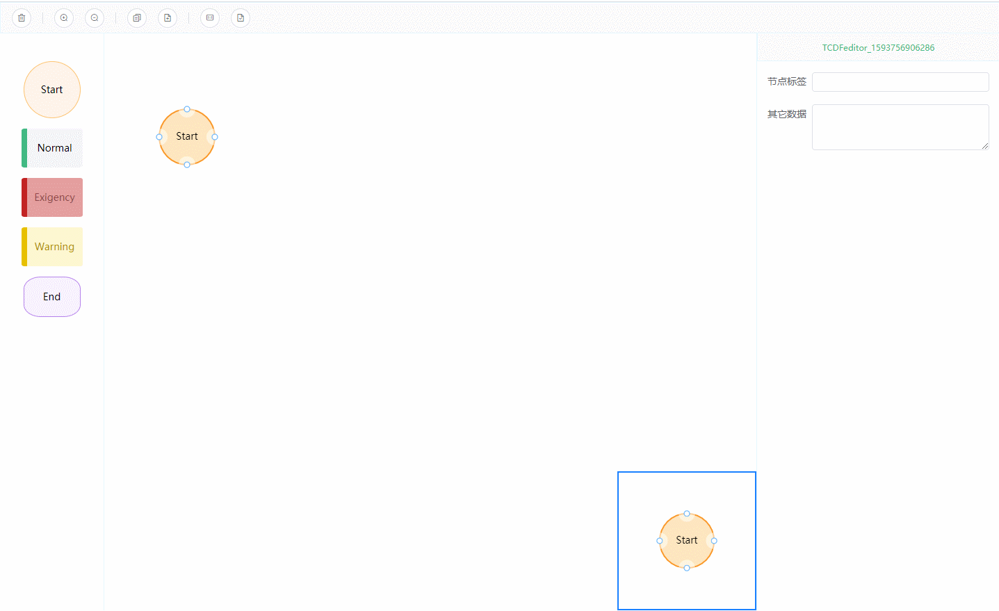

## 指南 
基于G6的vue流程编辑器，主要功能是在可视化图形界面画流程如，生成可保存的JSON数据，并能将JSON还原成流程图。
             
[预览地址](http://47.98.53.80:8004/)  
[项目文档](http://47.98.53.80:8003/)  
[[GitHub]源码开源地址](https://github.com/zimudehub/TFeditor)

特性
- 自由控制节点属性
- 提供画图工具按钮
- 支持miniMap
- 根据json渲染成图
    <p align="center">
      <a href="https://github.com/vuejs/vue">
        
      </a>
      <a href="https://github.com/ElemeFE/element">
        
      </a>
      <a href="https://github.com/antvis/G6">
        
      </a>
      <a href="https://github.com/zimudehub/FormDesignTCD/blob/master/LICENSE">
        
      </a>
    </p>
### 版本
<p align="center">
      <a href="https://github.com/zimudehub/FormDesignTCD">
        
      </a>
</p>

### 设计原则
flow-design-tcd本着尽可能使所有流程图信息由使用者通过图形界面操作。
## 快速上手
### 1.安装vue-cli
```
 npm install -g @vue/cli
 # OR
 yarn global add @vue/cli
```
### 2.创建一个项目
使用初始化项目命令
``` 
 vue create myapp
```
### 3.安装flow-design-tcd
``` 
 npm i flow-design-tcd --save
 # OR
 yarn add flow-design-tcd
```

### 4.使用flow-design-tcd
在项目main.js中
``` 
 import FlowDesignTCD from 'flow-design-tcd'
 import "flow-design-tcd/lib/flow-design-tcd.css"
 Vue.use(FlowDesignTCD)
```
以上步骤便完成便可在项目中直接使用flow-design-tcd。  
## 建议
::: warning
flow-design-tcd样式风格引用element-ui的组件库,使用过程中可搭配element使用。  
flow-design-tcd中对canvas渲染出的流程图,引用蚂蚁数据可视化G6,如若开发集成本插件源码,建议学习G6
:::


